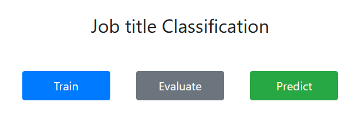
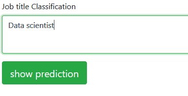
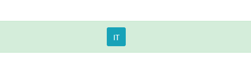

## Description: 
You can think of the job industry as the category or general field in which 
you work. On a job application, "industry" refers to a broad category under 
which a number of job titles can fall. For example, IT is an industry; job 
titles under this category can include data scientist, front-end developer, 
software engineer and so on.

I implemented a model that take a job title through an API and 
then predict the type of the industry.

In the `Job titles and industries` notebook, I loaded the dataset, 
explored it, and wrote my notes about it. then I used these 
notes to clean the data to make it suit for the machine learning 
model then I implemented model using Multinomial Naive Bayes because 
it is suitable for text classification. You can see the notebook, 
every step I did was documented.

Finally, I created a class(`IndustryClassification.py`) and put the steps I did in it as methods 
(get data, clean, preprocess, train, evaluate and predict). So I 
can make an object from this class in the API(`API.py`) and use all the 
above methods to build the application.

## How the API work:
Once you run the API and open your localhost with port 5000 
‘http://127.0.0.1:5000/’, Three buttons will appear.

By clicking on the first button `Train`, the model will start 
training on the data.
 
The second button `Evaluate` calculates the f1 score for the model. 

The last one `Predict` will take you to a text area to write your job title 

Then click on `show prediction` button and the model will predict your industry type.

